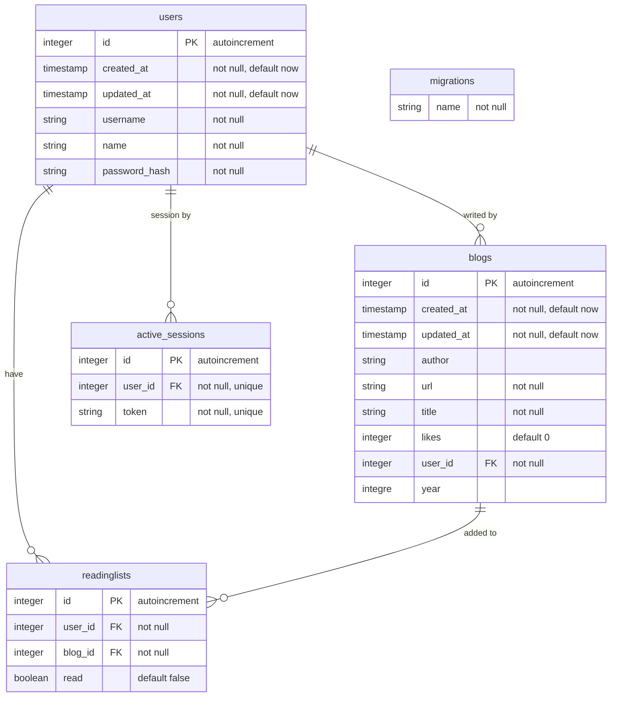

# Full Stack open

**Part 13** from [Full Stack open 2021 course](https://fullstackopen.com/en/). 

Following the course recommendation this part is developed on his own repository.

[Main repository](https://github.com/adecora/fullstackopen) with the other content of the course.

---
## Entity relationship diagram

